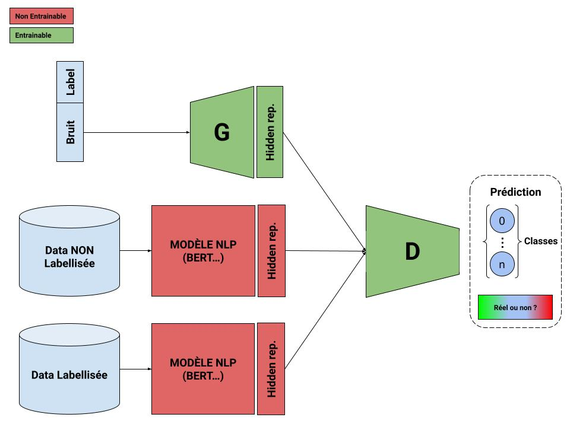

# TER-M2

L’objectif est de créer un modèle NLP basé sur un modèle pré-entraîné capable de
déterminer si un message français sur twitter relève du domaine de l’observation
d’un agriculteur ou non.

Entrainement de 4 modeles diffirents, le model M1 qui predit à T+1 dans le futur, le model M2 qui predit à de T+1 à T+2 etc... jusque M4 qui predit de T+1 à T+4
Pour chaque modele Mi on recupere les accuracy de la prediction de T+1 à T+i
Par exemple pour le modele:
     M1 (qui predit T+1) on a l'accuracy T+1
     M2 (qui predit T+1, T+2) on à l'accuracy T+1 et T+2
     M3 (qui predit de T+1 à T+3) on à l'accuracy T+1, T+2 et T+3
     M4 (qui predit de T+1 à T+4) on à l'accuracy T+1, T+2, T+3 et T+4
     
l'accuracy T+1 est donc mesurée chez le model M4, M3, M2 et M1
l'accuracy T+2 est donc mesurée chez le model M4, M3 et M2
l'accuracy T+3 est donc mesurée chez le model M4 et M3
l'accuracy T+4 est donc mesurée chez le model M4

Chaque modele est entrainé en validation croisée (3 folds)

epochs = 500
n_neurone_cache = 100
n_layer = 2
n_past = 10
n_future_max = 4
n_fold = 3

Pour n_future de 1 à n_future_max Faire:

    x, y = creerXY(n_past=n_past, n_future=n_future) // metre en forme l'input et l'output pour l'entrainement en fonction de la taille de la fenetre passé (n_past) et le nombre de prediction à faire dans le futur (n_future)

    Pour X_train, Y_train, X_val, Y_val dans validation_croisée(x, y, n_fold) Faire:

        // creer le modelen fonction du nombre de couche, neurones, fenetre de lecteur, nb prediction future
        modele = construire_le_modele(n_neurone_cache=n_neurone_cache, n_layer=n_layer, n_past=n_past, n_future=n_future)
        historique = entrainer(modele, X_train, Y_train, X_val, Y_val)

// historique contient les accuracy T+1 à T+n_future pour chaque modele M d'indice n_future (n_fold fois)